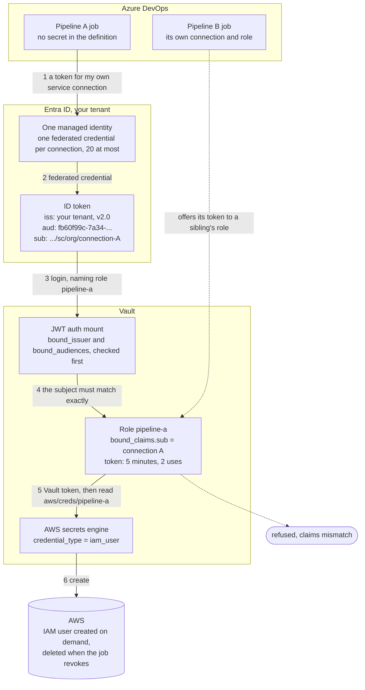
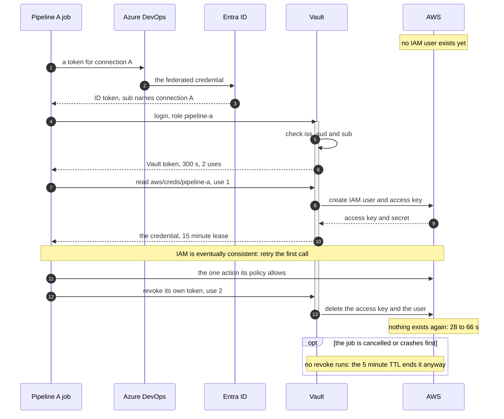

# Azure DevOps to HCP Vault, without a stored credential

A pipeline in Azure DevOps proves who it is to Vault using a token Entra ID mints for it, and gets back an AWS credential that exists for about thirty seconds. Nothing long-lived is stored anywhere: not in a variable group, not in a service connection, not in a secret store.

There are two things in this repository, and they are not equal.

| | What it is | State |
|---|---|---|
| [`terraform/`](terraform/), [`pipelines/`](pipelines/), [`demo/`](demo/) | Terraform, a pipeline template and the scripts that prove it, built and run end to end | **Tested.** Start here |
| [`docs/manual-setup/`](docs/manual-setup/) | The same design as a manual, click-and-curl walkthrough, for reading rather than running | Rewritten against the tested build |

## The earlier guidance is withdrawn

Until 23 September 2026 this repository recommended a design built on an **Azure Resource Manager access token**: the pipeline calls `az account get-access-token`, and Vault validates a token issued by `sts.windows.net` for the `https://management.core.windows.net/` audience. That works, and it removes stored credentials.

It has one problem, and it cannot be fixed.

**It cannot tell two pipelines apart.** An access token describes the managed identity and nothing else. Two pipelines sharing an identity produce identical tokens, so Vault cannot give them different roles. The only way to separate them is one identity per pipeline, which is the standing-credential sprawl this was meant to remove.

Note that Microsoft's retirement of the Azure DevOps issuer `https://vstoken.dev.azure.com` on 1 July 2027 is **not** a second reason. That retirement applies to the federated credential on a workload identity federation service connection, which both designs use, so it separates neither. It is also not the `sts.windows.net` issuer an access token carries, which Microsoft has announced no end of life for. What it does mean is that a connection must be on the Entra issuer, which is what the tested design needs anyway and what new connections already get by default. The dates and the exact scope are in [docs/DESIGN_REVIEW.md](docs/DESIGN_REVIEW.md).

That guidance also optimised for **Vault client count**, treating fewer entities as the goal. That framing is gone. Client count is a licensing consequence of a design, not a security property, and shaping authorisation around it produces roles that are deliberately too broad.

Every guide in `docs/manual-setup/` has since been rewritten against the tested build, and seven files that taught the old design end to end were withdrawn rather than corrected.

What replaced it, and the reasoning including the options rejected along the way, is in [docs/DESIGN_REVIEW.md](docs/DESIGN_REVIEW.md).

## How the tested design works

A pipeline asks Azure DevOps for an **Entra-issued ID token for its own service connection**. The subject Entra writes into that token names the *connection*, not the identity behind it. That single difference is what makes everything else possible: one managed identity can back many connections, and Vault can still bind a role to one exact pipeline.



A pipeline that offers its token to a sibling's role is refused, because the subject does not match. That refusal is one of the acceptance tests, not a claim.

The credential that comes back is created on demand and destroyed by the job that asked for it:



If the job crashes, the five-minute TTL ends the lease anyway. Revocation is the fast path, not the only one.

## What was measured

Nine acceptance tests, run live against a real Azure DevOps organisation, Azure subscription, AWS account and HCP Vault cluster. Among them:

- A pipeline offered another pipeline's role is refused, on a claims mismatch.
- The credential is denied every action its Vault role does not grant.
- AWS rejects the credential seconds after the job revokes it.
- No Vault token, AWS key or raw JWT appears in any pipeline log, checked by script across every log part of every run.

The full table, with the evidence for each, is in [docs/VALIDATION.md](docs/VALIDATION.md).

## Getting started

```bash
cd terraform
cp example.tfvars terraform.tfvars   # fill in three values
terraform init
terraform apply -parallelism=1
```

`example.tfvars` names exactly what a new environment has to supply and what it can leave alone. Everything else, including the Vault mounts, roles, policies, service connections, federated credentials and the pipelines themselves, is created for you.

To show it to an audience rather than read about it, [docs/DEMONSTRATING.md](docs/DEMONSTRATING.md) is a three-act walkthrough with the questions people actually ask and what to answer.

## Repository map

```
terraform/            the whole build
pipelines/            the pipeline template and the script it runs
demo/                 watchers for IAM, Vault's audit log, and a log scanner
docs/
  VALIDATION.md       what was measured, with the nine acceptance tests
  DEMONSTRATING.md    how to demonstrate this live
  DESIGN_REVIEW.md    the design argument, and what was rejected
  COMMON_PITFALLS.md  troubleshooting: symptoms, causes and the reasoning
  manual-setup/       STEP_1 to STEP_5, the manual path, and
                      ADVANCED_CONFIG.md, the decisions you revisit at scale
```

## Prerequisites

- An Azure DevOps organisation and project, with a free parallel job available
- An Entra tenant connected to that organisation
- An Azure subscription you can create a resource group and a managed identity in
- An HCP Vault cluster, and an AWS account for the dynamic credentials
- Terraform, the Azure CLI, and a personal access token for Azure DevOps

The first two stall a fresh organisation for longer than anything else here. Check them first.

## Getting help

- [docs/COMMON_PITFALLS.md](docs/COMMON_PITFALLS.md) for symptoms and causes
- HashiCorp Community: https://discuss.hashicorp.com
- HCP Vault Support: https://support.hashicorp.com
