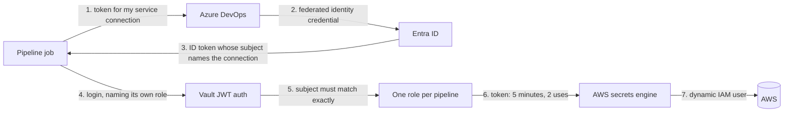
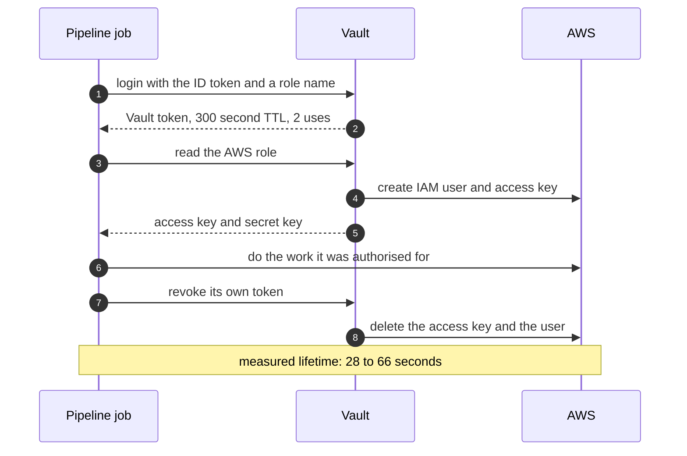

# Azure DevOps to HCP Vault, without a stored credential

A pipeline in Azure DevOps proves who it is to Vault using a token Entra ID mints for it, and gets
back an AWS credential that exists for about thirty seconds. Nothing long-lived is stored anywhere:
not in a variable group, not in a service connection, not in a secret store.

There are two things in this repository, and they are not equal.

| | What it is | State |
|---|---|---|
| [`poc/`](poc/) | Terraform, a pipeline template and the scripts that prove it, built and run end to end | **Tested.** Start here |
| `STEP_1` to `STEP_5`, `COMMON_PITFALLS.md` | A manual, click-and-curl walkthrough written earlier | Older design, being corrected. See below |

## The earlier guidance is withdrawn

The STEP guides describe a design built on an **Azure Resource Manager access token**: the pipeline
calls `az account get-access-token`, and Vault validates a token issued by `sts.windows.net` for the
`https://management.core.windows.net/` audience. That works, and it is what the first version of this
repository recommended.

It has two problems, and one of them cannot be fixed.

**It cannot tell two pipelines apart.** An access token describes the managed identity and nothing
else. Two pipelines sharing an identity produce identical tokens, so Vault cannot give them different
roles. The only way to separate them is one identity per pipeline, which is the standing-credential
sprawl this was meant to remove.

**It is being retired.** Azure DevOps ends support for that issuer on 1 July 2027.

The guidance in those files also optimised for **Vault client count**, treating fewer entities as the
goal. That framing is gone. Client count is a licensing consequence of a design, not a security
property, and shaping authorisation around it produces roles that are deliberately too broad.

What replaced it, and the reasoning including the options rejected along the way, is in
[docs/DESIGN_REVIEW.md](docs/DESIGN_REVIEW.md).

## How the tested design works

A pipeline asks Azure DevOps for an **Entra-issued ID token for its own service connection**. The
subject Entra writes into that token names the *connection*, not the identity behind it. That single
difference is what makes everything else possible: one managed identity can back many connections,
and Vault can still bind a role to one exact pipeline.



A pipeline that offers its token to a sibling's role is refused, because the subject does not match.
That refusal is one of the acceptance tests, not a claim.

The credential that comes back is created on demand and destroyed by the job that asked for it:



If the job crashes, the five-minute TTL ends the lease anyway. Revocation is the fast path, not the
only one.

## What was measured

Nine acceptance tests, run live against a real Azure DevOps organisation, Azure subscription, AWS
account and HCP Vault cluster. Among them:

- A pipeline offered another pipeline's role is refused, on a claims mismatch.
- The credential is denied every action its Vault role does not grant.
- AWS rejects the credential seconds after the job revokes it.
- No Vault token, AWS key or raw JWT appears in any pipeline log, checked by script across every log
  part of every run.

The full table, with the evidence for each, is in [poc/README.md](poc/README.md).

## Getting started

```bash
cd poc/terraform
cp example.tfvars terraform.tfvars   # fill in three values
terraform init
terraform apply -parallelism=1
```

`example.tfvars` names exactly what a new environment has to supply and what it can leave alone.
Everything else, including the Vault mounts, roles, policies, service connections, federated
credentials and the pipelines themselves, is created for you.

To show it to an audience rather than read about it, [poc/DEMONSTRATING.md](poc/DEMONSTRATING.md) is
a three-act walkthrough with the questions people actually ask and what to answer.

## Repository map

```
poc/
  terraform/          the whole build
  pipelines/          the pipeline template and the script it runs
  demo/               watchers for IAM, Vault's audit log, and a log scanner
  README.md           what was measured, with the nine acceptance tests
  DEMONSTRATING.md    how to demonstrate this live
docs/
  DESIGN_REVIEW.md    the design argument, and what was rejected
STEP_1..STEP_5.md     the manual path, older design, being corrected
COMMON_PITFALLS.md    troubleshooting, partly corrected
```

## Prerequisites

- An Azure DevOps organisation and project, with a free parallel job available
- An Entra tenant connected to that organisation
- An Azure subscription you can create a resource group and a managed identity in
- An HCP Vault cluster, and an AWS account for the dynamic credentials
- Terraform, the Azure CLI, and a personal access token for Azure DevOps

The first two stall a fresh organisation for longer than anything else here. Check them first.

## Getting help

- [COMMON_PITFALLS.md](COMMON_PITFALLS.md) for symptoms and causes
- HashiCorp Community: https://discuss.hashicorp.com
- HCP Vault Support: https://support.hashicorp.com
